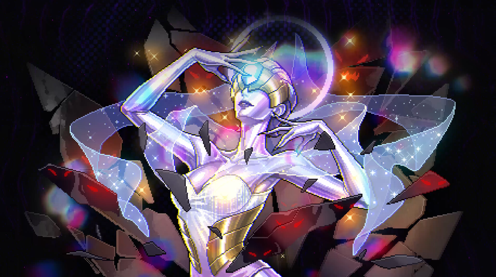
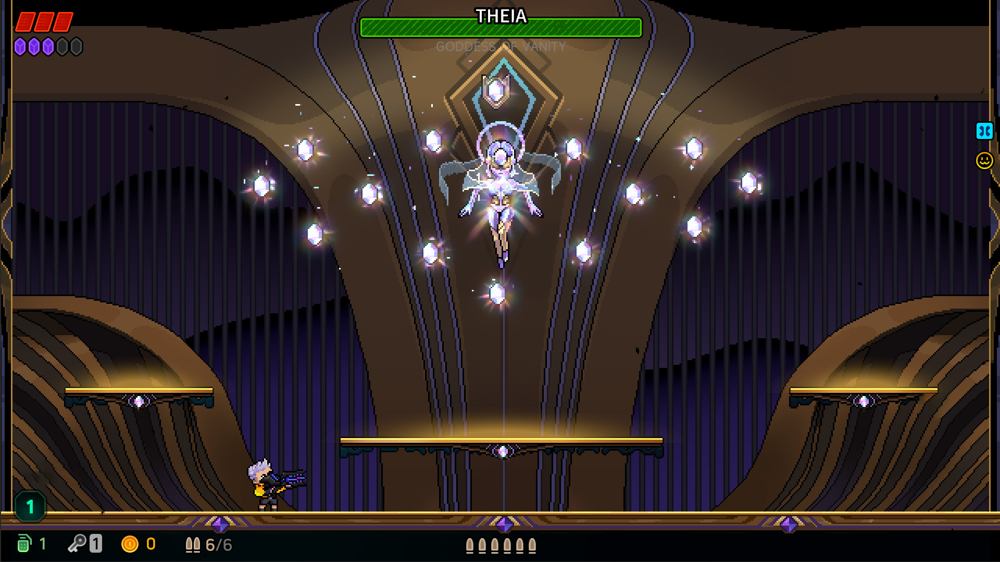
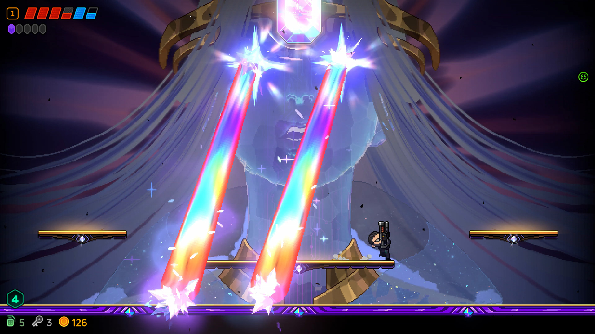
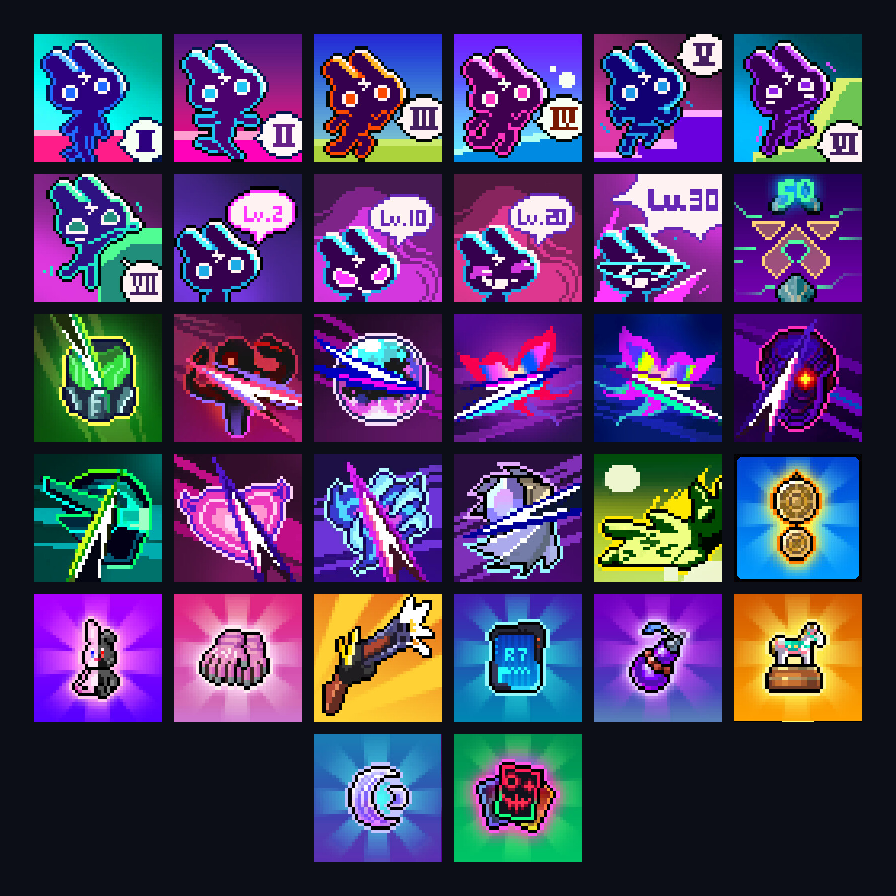
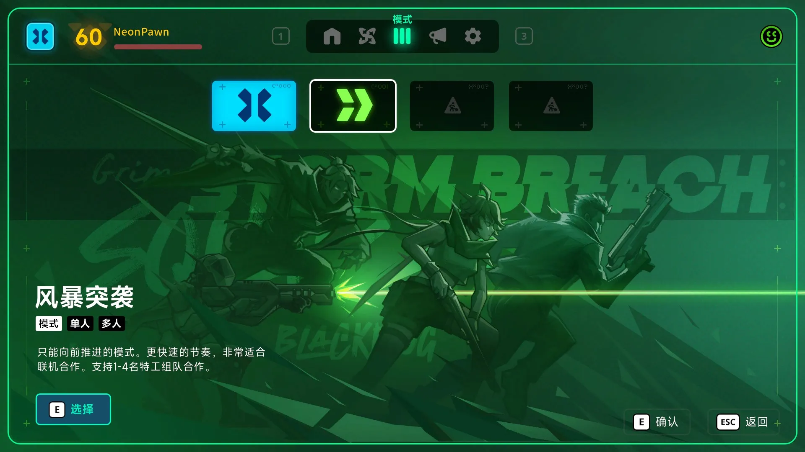
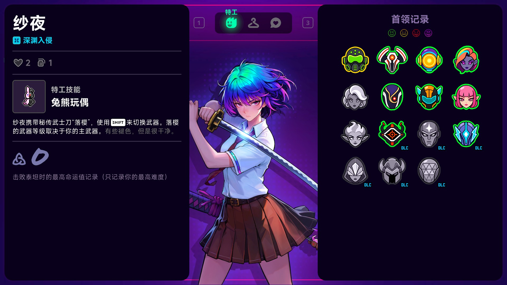
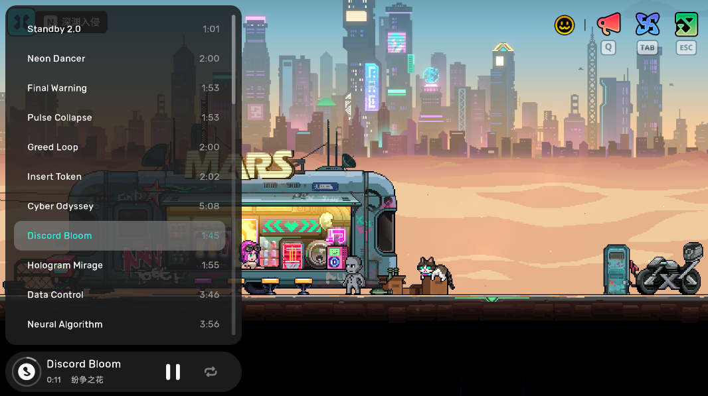

# 《霓虹深渊2》1.0 版本全平台上线！
特工们，久等了！
《霓虹深渊2》正式迎来 1.0 版本，抢先体验阶段也随之结束！
感谢每一位在抢先体验期间走进深渊的特工。你们的建议与批评，帮助我们不断把游戏体验打磨得更好。在发布前这段时间，我们补充了新的 Boss 挑战和构筑内容，调整了开局、房间交互与音乐体验，并持续优化性能、操控和界面。争取在正式版给所有特工带来最完整最稳定的深渊体验！

---
## 1.0 更新内容摘要
- 全新泰坦 BOSS
- Steam 成就正式加入
- 新模式：风暴突袭
- 随机特工与全新特工档案系统
- 套装调整、词缀扩展与部分信仰调整
- 钓鱼房新增昼夜变化与隐藏 BOSS
- 补充酒吧音乐体验
---
## 全新泰坦 BOSS
### **缇娅 - 虚荣之神**
泰坦集团首席品牌官（CBO），定义美与流行的绝对权威。她将审美变为枷锁，用璀璨的光芒蒙蔽众生，让人们在追逐虚荣中失去自我。

---
## Steam 成就
Steam 成就正式加入！我们更新了Steam成就支持，已经达成条件的成就会自动解锁。

---
## 新增模式：风暴突袭
全新模式「风暴突袭」上线！这是一个更简单快速的模式，选择不同的路线，挑战层层关卡，非常适合联机组队体验！

---
## 特工档案和高层 Boss 挑战路线
全新特工档案系统上线！你可以在档案中查看特工的专属技能、BOSS 击杀记录与最高命运值。还有目标页面的 BOSS 路线图也会展示挑战路线、节点资料与解锁状态，方便规划下一步挑战。
我们还增加了随机特工【???】！使用该特工进入深渊时，你将随机化身为一名特工，并额外获得一件宝物，为每次冒险带来一些意外和小惊喜。

---
## 信仰与徽章调整
工匠信仰迎来重做，将与全新的词缀徽章机制一同带来更多构筑选择。

---
## 钓鱼房优化

- **昼夜变化**：新增昼夜交替、天空、水面倒影与距离雾等场景表现，在夜晚的钓鱼房看看银河也相当惬意。
- **隐藏 BOSS**：新增宝箱相关的隐藏 BOSS 遭遇，具体条件等待特工们自行探索。
---
## 酒吧音乐播放器
如果玩家拥有 OST 或支持者包 DLC，那么就可以使用播放器播放任意游戏 OST 内的音乐曲目。

---
## 闪兔装扮更新
闪兔装扮上新啦！本次加入多款全新装扮，拥有支持者包的玩家还会有更多额外惊喜！

---
## 套装调整
本次对部分套装进行机制重做，并改善了视觉表现，让凑齐套装的体验更有满足感！
- **偷天大盗**：从主动付费破解调整为永久彩虹钥匙与范围内自动破解。真实钥匙数量会增加可连接目标，破解节奏受攻速影响。
- **合金意志**：在原有爆炸免伤与免费手雷效果基础上，新增手雷爆炸范围 1.5 倍，并优化护盾的视觉反馈。
- **可爱军团**：优化宠物蛋转化为护盾时的表现与套装特效，使转化过程和获得收益更清楚。
- **狂欢派对**：重做跳跃印记机制，持续生成触发印记，每第 3 个印记替换为自动瞄准的追踪炮台云，形成新的跳跃输出构筑。
- **道法自然**：改为每场战斗生成 10 个紫色暗灵，暗灵重生时间缩短至原来的 10%，冲锋速度提升至 2 倍，并补充命中特效。
- **奥术回响**：主动奇物的水晶消耗减半，最低消耗 1 个；施放时积蓄水晶匕首，最多储存 6 把，在战斗中周期性发射，攻击节奏受攻速影响。
---
## 重点体验优化
- **惊奇骰子获取**：部分商店或雅典娜奖励房有机会获得大惊奇方块（惊奇骰子），玩家有更多机会完成自己想要的构筑。
- **微笑商人**：遇到微笑商人时，可以根据当前资源决定是否兑换；若当前支付资源不合适，可长按并花费金币，随机切换为金币、红心、炸弹、钥匙或蛋等其他支付类型，让特工们的富余资源有更多用处。
- **武器经验魔罐**：改为按配置面额释放灵魂，由玩家拾取获得经验。
- **进化之路调整**：调优进化之路的解锁顺序，优化新手期体验。
- **画质与帧率**：画质和帧率独立设置；PC 提供中/高画质及 60/120/不限帧率，并按显示器条件处理垂直同步。
- **超宽屏适配**：补充 2560×1080、3440×1440、3840×1600 等 21:9 分辨率。
- **手柄与菜单**：菜单键支持逐级返回，QTE 跟随自定义移动键，便于按自己的操作习惯游玩。
- **震动与声音**：手柄震动和屏幕震动分别设置，减少普通攻击频繁震动；拾取和分解音效按房间范围播放。
- **本地化**：重新审校，优化小语种本地化体验。
- **加载与换层**：将部分场景、房间和资源准备拆分到多帧，按实际角色、装备与房间需求加载，改善加载节奏。
- **高频攻击性能**：优化光球、星尘的命中特效回收与伤害反馈。
---
## 重点 Bug 修复
- **风暴突袭信仰房传送**：修复风暴突袭模式中进入信仰房后，无法通过传送返回主流程的问题，避免玩家被困在信仰房、无法继续推进关卡。
- **继续游戏无法操作**：修正首次进入房间、继续存档或门过渡失败后残留方向锁的问题，以及飞行状态进入下一层卡在空中的情况。
- **联机结算收不齐**：修正结算信息提前到达、重复上报或玩家离队时，部分队员的结算卡片缺失或显示不完整的问题。
- **结算与返回酒吧**：修正主机或客机在结算切场时断线导致酒吧无角色，以及风暴突袭 BOSS 结束后返回酒吧卡住的问题；结算成长数据与经验动画分离，提前跳过动画不再跳过成长应用。
- **主机假在线与退出**：修正主机已经离线、客机仍误认房间在线的问题；PC 正常退出时会通知同伴，并改善邀请加入时的等待与失败反馈。
- **个人存档与联机隔离**：修正联机进度混入个人存档、正常单机返回主菜单被误清档、断线转为单机后无法正常续玩，以及客机进化购买和命运规则记录错误的问题。
- **历史档与备份**：补充历史存档读取兼容和动态关卡恢复校验；Steam 备份与恢复同时处理主档及对应进度数据，坏档先保留现场，避免不匹配内容继续覆盖。
- **BOSS 阶段与房门**：修正部分 BOSS 房门无法进入、宙斯不行动、部分 BOSS 阶段无法继续，以及机械守卫隐藏后战斗不再推进的问题；清理阿波罗终场残留攻击并修正部分攻击瞄准位置。
- **武器与经验**：修正能量耗尽后无法重新充能、升级或分解窗口误吸灵魂损失经验、炫金棒球不回收、雷切蓄力倍率失效，以及近战攻速重复计算。
- **奖励误删与重复**：修正互斥奖励清理误删独立奖励、迷幻蝴蝶重复发奖、唯一惊奇物单局重复掉落，以及掉落物卡墙或被纠偏到远处的问题。
- **碰撞与交互阻断**：修正缩小后卡地形或瞬移穿墙、部分 BOSS/黑犬宝箱碰撞阻挡、挑战失败后房门和战斗状态未恢复，以及快速拿放物品隐形或卡持物状态。
- **输入残留与页面阻塞**：修正页面重复打开、隐藏页面仍响应输入，以及联机弹窗结束后角色仍无法操作的问题；修正双手柄切换和酒吧坐下后无法起身的情况。
- **多人同步与道具**：修正联机近战动画丢失、停止攻击报错、纸枪弹数不一致、金币拾取归属错误、跨房间地雷误爆，以及部分房间机关状态同步不及时的问题。
- **已购内容保护**：修正支持者纱夜皮肤被另一 DLC 撤销分支误删，以及切换存档进入联机后角色预览资源不匹配的问题。
- **BOSS 挑战计时**：修正黑暗宙斯入口的挑战时间判定：按本局有效游戏时间检查 30 分钟条件，暂停和加载不计时，续局保留累计时间；已打开的门不会因随后超过时限而关闭。
- **钓鱼房隐藏 BOSS**：修正部分箱子不触发遭遇、BOSS 资源未准备、战斗与出口状态异常，以及击败对应 BOSS 后关联宝箱仍收费的问题。
- **武器词缀与套装**：修正吉米、噪波、礼炮、MIRA 等武器的数量加成应用，以及换层、续局、重连后的套装恢复和一次性奖励重复授予问题。
- **复活与暗灵**：修正不朽契约清空剩余复活次数、R7 与创伤会员组合复活后生命异常，以及君临暗灵重复恢复、存储暗灵影响禁忌瞳术等构筑问题。
- **重掷与锻造兼容**：修正染血骰子与大惊奇方块联用、商店购买后陈列物重掷、神殿奖励来源、爪机内重掷位移，以及私有灵魂和锁定掉落被错误刷新的问题；修正工匠锻造词缀奖励与重掷道具、房间机关的兼容问题。
- **微笑商人交易**：修正联机客机交易后商人没有正确关店的问题。
- **武器经验灵魂落点**：修正武器经验魔罐释放的灵魂错误掉落在世界原点的问题。
- **小游戏交互**：修正舞台、抓娃娃机未获得交互权限便锁定角色、失败后输入未释放的问题；修正足球房多人同时启动和上一局协程干扰。
- **返回石交互**：增加返回石的短暂准备时间，转场被拒绝时恢复交互，修正按钮失效后无法再次返回的问题。
- **加载与预览异常**：修正加载后先露出空场景、角色尚未生成的问题；切角色、切档或换场景后拒绝过时加载结果，修正旧预览覆盖、缺图和跨场景资源误卸载。
- **画面与界面显示**：修正画质变化覆盖帧率选择、像素画面与交互提示错位一帧、屏幕边缘武器对比面板裁切、水面倒影镜像和比例异常，以及充能条跳变或切形态后消失。
- **菜单与焦点**：修正手柄操作误关闭曲库、图鉴焦点、换装返回、公告过期请求与背景图片恢复问题；减少双手柄漂移或归零抢占导致的移动中断，并处理选择页确认键穿透与键位重绑取消异常。
- **死亡与返回后的声音**：修正死亡、救援及返回酒吧后混音、持续声与背景音乐未正确恢复的问题。
- **惊奇骰子遭遇战**：修正惊奇骰子触发额外战斗时怪物与波次状态异常，避免怪群未正确计入战斗、清场后仍卡在战斗状态。
- **惊奇口袋取用**：修正从惊奇口袋取出方块后位置回弹、缩放异常或不可见，以及联机交互控制权归属异常的问题。
## 接下来
1.0 是新的起点。我们会继续听取特工们的反馈，持续打磨游戏，并在后续版本中带来更多内容。
感谢所有特工一路同行，咱们深渊里见！
**Veewo Games**