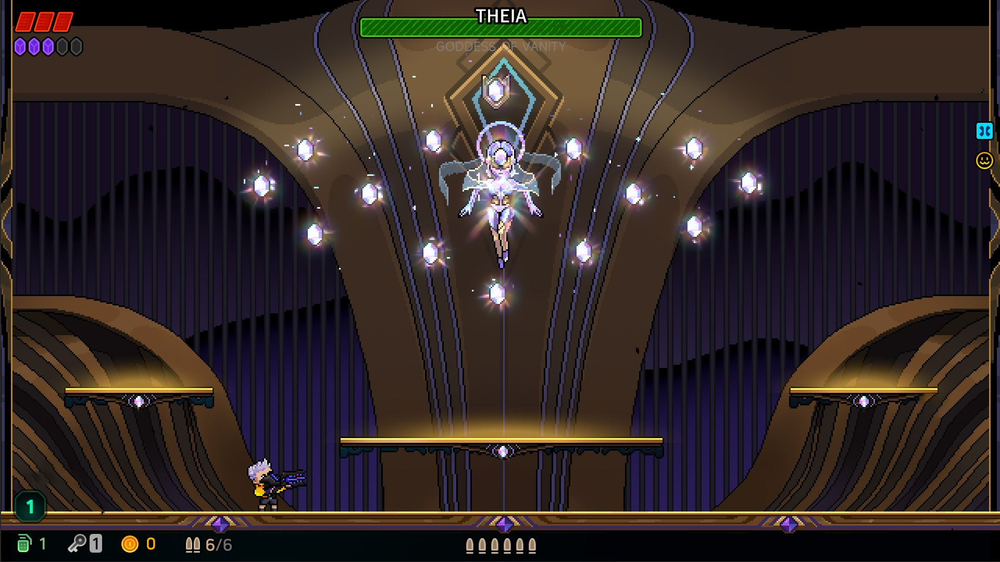
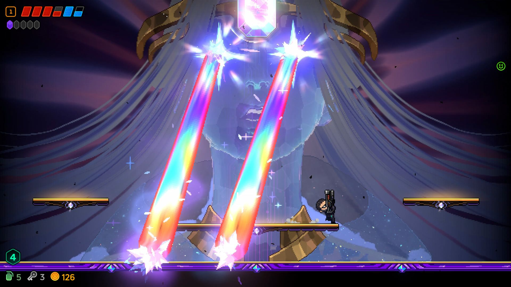
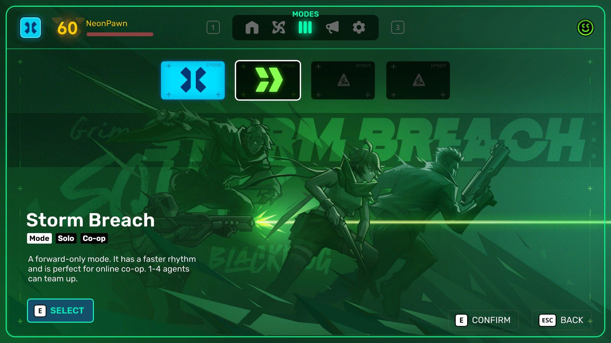
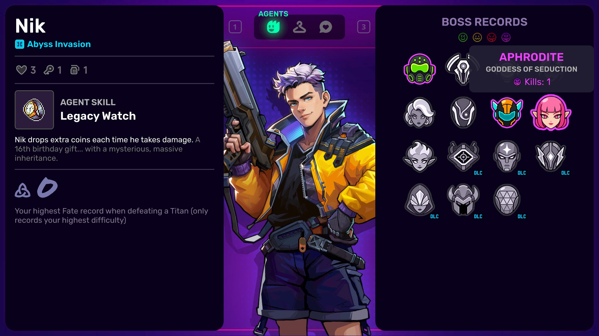
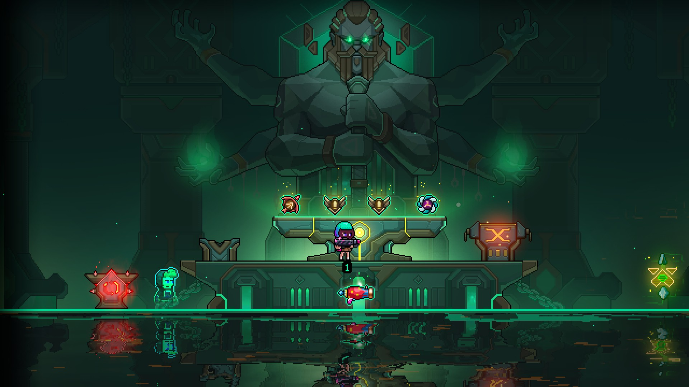
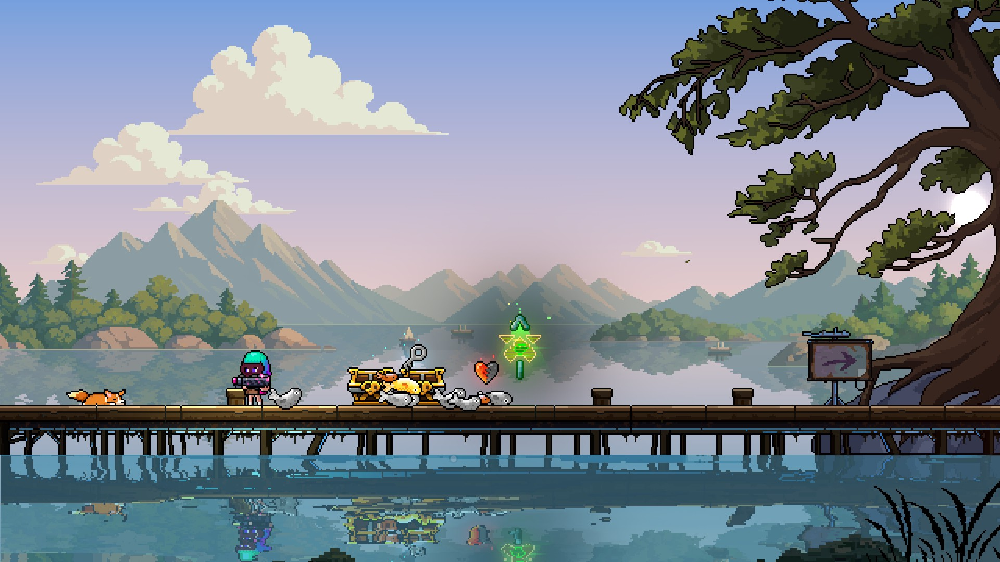
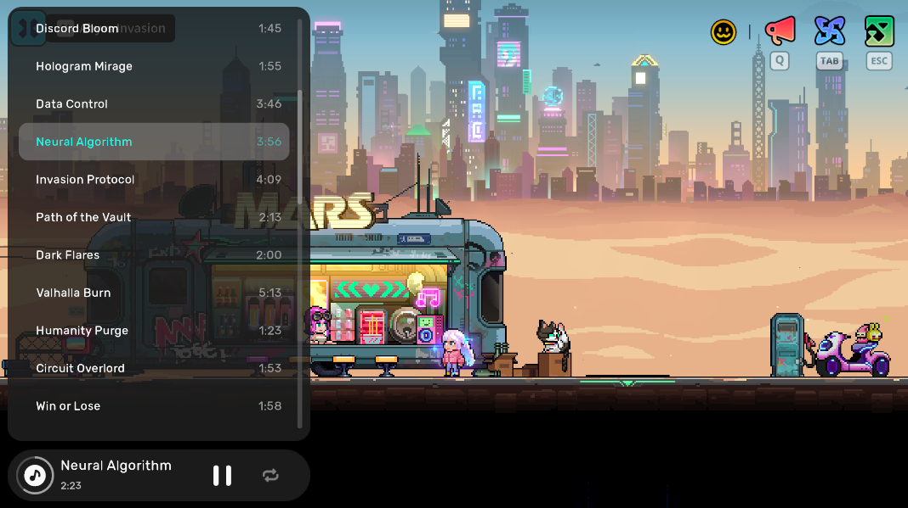

# Neon Abyss 2 Version 1.0 Is Out Now!
Agents, the wait is over!
Neon Abyss 2 has officially reached Version 1.0, bringing Early Access to a close!
To every agent who ventured into the Abyss during Early Access: thank you! Your suggestions and criticism have helped us keep improving the game. In the lead-up to launch, we've added new boss challenges and build options, refined the opening stages, room interactions, and music experience, and continued improving performance, controls, and the interface. Our goal is to give every agent the most complete and stable Abyss experience yet!
---
## Version 1.0 Highlights
- New Titan Boss Arrives
- Steam Achievements Arrive
- New Mode: Storm Breach
- Random Agent and New Agent Profiles
- Set, Affix, and Faith Updates
- Fishing Room Day/Night Cycle and Hidden Boss
- More Music at the Bar
---
## New Titan Boss
### **Theia — Goddess of Vanity**
Titan Group's Chief Brand Officer (CBO), the ultimate authority defining beauty and trends. She turns aesthetics into shackles, blinding all with dazzling light, causing people to lose themselves chasing vanity.

---
## Steam Achievements
Steam Achievements are here! We've updated Steam Achievement support, and achievements whose requirements you've already met will unlock automatically.
---
## New Mode: Storm Breach
The new Storm Breach mode is here! It's a simpler, faster mode where you choose your route and tackle a series of stages. It's perfect for online co-op!

---
## Agent Profiles and Elite Boss Routes
The new Agent Profiles system is here! View each agent's unique skills, boss kill record, and highest Fate record in their profile. The Boss Route Map on the Targets page also shows challenge routes and unlock status, making it easier to plan your next challenge.
We also added the new ??? agent! Chosse this agent will let you dive in the abyss with a random agent and an additional Artifact, bringing a few unexpected twists and little surprises to every adventure.

---
## Faith and Badge Updates
The Artisanism Faith has been reworked. Now badge will become a new Affix after crafting, it opens up more build possibilities for your beloved weapon.

---
## Fishing Room Improvements

- **Day/Night Cycle**: Added changing day and night scenery, skies, water reflections, and distance fog. Take a moment to enjoy the Milky Way from the Fishing Room at night.
- **Hidden Boss**: Added a hidden boss encounter involving treasure chests. We'll leave the conditions for you to discover!
---
## Bar Music Player
If you own the OST or Supporter Pack DLC, you can use the music player to play any track from the game's OST.

---
## Zapbit Outfit Update
Zapbit has new outfits! This update adds several new looks, with even more surprises for Supporter Pack owners.
---
## Set Updates
This update reworks some set mechanics and improves their visuals, making completed sets feel even more satisfying!
- **Sky Heist**: Replaces paid manual hacking with a permanent rainbow key and automatic hacking of nearby targets. Carrying more regular keys increases the number of targets you can connect to, while attack speed affects the hacking rate.
- **Alloy Resolve**: In addition to its existing explosion immunity and free grenades, grenade blast range is now 1.5× its previous value. Shield visuals have also been improved.
- **Lovely Legion**: Improved the visuals of Hatchmon eggs turning into shields, along with the set's effects, making the conversion and its benefits clearer.
- **Carnival Frenzy**: Reworked Jump Marks. Marks are generated and triggered continuously, with every third mark replaced by an auto-targeting turret cloud that fires homing projectiles, opening up a new jumping-focused damage build.
- **Tao Unfolds**: Now generates 10 Purple Wisps in each battle. Wisp respawn time is reduced to 10% of its previous value, charge speed is doubled, and new hit effects have been added.
- **Arcane Echo**: Halves the Crystal cost of active Curios, with a minimum cost of 1 Crystal. Using a Curio stores Crystal Daggers, up to a maximum of 6, which fire periodically in battle at a rate affected by attack speed.
---
## Key Experience Improvements
- **Wonder Blocks**: Some shops and Athena reward rooms now have a chance to offer a Great Wonder Block, giving you more opportunities to shape the build you want.
- **Smiley Merchant**: Decide whether to trade based on the resources you have. If the current payment type doesn't suit you, hold the interaction button and spend coins to randomly switch to another payment type: coins, hearts, bombs, keys, or eggs. Your spare resources now have more uses.
- **Weapon XP Hexjar**: Now releases souls in set amounts for you to pick up and gain weapon XP.
- **Evolution Progression**: Refined the order of evolution unlocks for a smoother early-game experience.
- **Graphics and Frame Rate**: Graphics quality and frame rate can now be set independently. PC supports Medium/High quality and 60/120/uncapped frame rates, with VSync handled according to your display.
- **Ultrawide Support**: Added 21:9 resolutions, including 2560×1080, 3440×1440, and 3840×1600.
- **Controllers and Menus**: The menu button can take you back one level at a time, and QTEs follow your custom movement bindings.
- **Vibration and Audio**: Controller vibration and screen shake have separate settings, with less frequent vibration during normal attacks. Pickup and dismantling sounds play within the relevant room.
- **Localization**: Reviewed and refined translations to improve the experience in additional languages.
---
## Key Bug Fixes
- **Storm Breach Faith Room Teleports**: Fixed being unable to teleport back to the main route after entering a faith room in Storm Breach, preventing players from becoming trapped and unable to continue the run.
- **Controls After Continuing a Run**: Fixed movement remaining locked after first entering a room, continuing a save, or a failed door transition, as well as becoming stuck in midair when entering the next floor while flying.
- **Missing Co-op Results**: Fixed missing or incomplete teammates' results cards when results arrived early, were submitted more than once, or a player left the room.
- **Results and Returning to the Bar**: Fixed missing characters at the bar after a host or client disconnected during the results transition, and getting stuck when returning to the bar after a Storm Breach boss. Progression is now applied separately from the XP animation, so skipping the animation no longer skips progression gains.
- **Host Disconnects and Exiting**: Fixed clients still treating a room as online after the host had disconnected. Exiting normally on PC now notifies teammates, with improved waiting and failure feedback when joining through an invitation.
- **Personal Saves and Co-op Progress**: Fixed co-op progress leaking into personal saves, solo saves being cleared incorrectly when returning to the main menu, missing continuation data after switching to solo play following a disconnect, and incorrect ownership of clients' evolution purchases and Fate settings.
- **Older Saves and Backups**: Improved compatibility with older saves and validation when restoring dynamic levels. Steam backups and restores now handle the main save and its matching progression data together. Corrupted saves are preserved before recovery to prevent mismatched data from overwriting them.
- **Boss Phases and Room Doors**: Fixed some boss room entrances being inaccessible, Zeus not acting, some boss phases failing to advance, and combat not progressing after mechanical guards became hidden. Also cleared lingering attacks from Apollo's final phase and corrected some attack targeting positions.
- **Weapons and XP**: Fixed weapons failing to recharge after energy ran out, souls being absorbed incorrectly during upgrades or dismantling and causing lost XP, GLITZ baseballs not returning, VOLTEDGE's charged damage multiplier not applying, and melee attack speed being counted twice.
- **Lost and Duplicate Rewards**: Fixed cleanup of mutually exclusive rewards removing independent rewards, duplicate rewards from psychedelic butterfly encounters, unique Wonder items dropping more than once per run, and drops becoming stuck in walls or being repositioned too far away.
- **Collision and Blocked Interactions**: Fixed getting stuck in terrain after shrinking or teleporting through walls, collision blocking around some bosses and Blackdog Chests, room doors and combat state not resetting after a failed challenge, and items becoming invisible or getting stuck in a held state when picked up and put down quickly.
- **Input and UI Blocking**: Fixed pages opening more than once, hidden pages still responding to input, and controls remaining blocked after co-op popups closed. Also fixed issues with switching between two controllers and being unable to stand up after sitting down at the bar.
- **Co-op Sync and Items**: Fixed missing melee animations, errors when stopping attacks, ORIGAMI ammo counts differing between players, incorrect ownership of collected coins, mines detonating across rooms, and delayed synchronization of some room mechanisms.
- **Purchased Content**: Fixed a Supporter Pack Saya skin being removed incorrectly when a different DLC was revoked, and mismatched character preview resources after switching saves and entering co-op.
- **Boss Challenge Timer**: Fixed the 30-minute entry check for Dark Zeus. It now uses active playtime, excluding pauses and loading, and keeps elapsed time when continuing a run. An already-open door won't close if the time limit is exceeded afterward.
- **Fishing Room Hidden Boss**: Fixed some chests failing to trigger the encounter, boss resources not being ready, incorrect combat and exit states, and linked chests still charging a fee after the corresponding boss was defeated.
- **Weapon Affixes and Sets**: Fixed projectile-count bonuses on JIMMY, NOISE, SALUTE, and MIRA, set restoration after changing floors, continuing a run, or reconnecting, and one-time rewards being granted more than once.
- **Revives and Wisps**: Fixed Undying Pact clearing remaining revives, incorrect health after reviving with the R7 and Trauma VIP combination, duplicate Wisp restoration with ASCEND, and stored Wisps incorrectly affecting Forbidden Techniques builds.
- **Rerolls and Forging**: Fixed issues when combining Bloodied Dice and Great Wonder Blocks, rerolling shop displays after purchases, temple reward sources, items moving incorrectly when rerolled inside the crane machine, and private souls or locked drops being rerolled incorrectly. Also fixed compatibility between forged Affix rewards, reroll items, and room mechanisms.
- **Smiley Merchant Trades**: Fixed the merchant not closing correctly after a co-op client completed a trade.
- **Weapon XP Soul Drops**: Fixed souls released by the weapon XP Hexjar dropping at the world's origin instead of the correct location.
- **Minigame Interactions**: Fixed the stage and crane machine locking characters before interaction permission was granted, and input not being released after a failed interaction. Also fixed players starting the football minigame simultaneously and leftover routines from the previous game interfering with the next one.
- **Return Stone Interactions**: Added a brief preparation period to return stones and restored interaction when a transition is rejected, fixing cases where the button stopped working and players couldn't try again.
- **Loading and Previews**: Fixed scenes appearing empty before characters had spawned. Outdated loading results are now discarded after changing characters, saves, or scenes, fixing old previews overwriting new ones, missing images, and resources being unloaded incorrectly between scenes.
- **Graphics and UI Display**: Fixed changes to graphics quality overriding the selected frame rate, pixel graphics and interaction prompts being offset by one frame, weapon comparison panels being clipped at screen edges, incorrect water-reflection mirroring and proportions, and charge bars jumping or disappearing after switching forms.
- **Menus and Focus**: Fixed controller input closing the music library unintentionally, Codex focus, returning from outfit selection, outdated announcement requests, and background image restoration. Reduced movement interruptions caused by drift or neutral input from a second controller, and fixed confirmation input carrying over from selection screens and issues canceling key rebinding.
- **Audio After Death and Returning to the Bar**: Fixed audio mixing, looping sounds, and background music not recovering correctly after death, rescue, or returning to the bar.
- **Wonder Block Encounters**: Fixed incorrect monster and wave states when Wonder Blocks triggered an extra battle, including monsters not being registered in combat and rooms remaining in combat after being cleared.
- **Wonder Pocket Retrieval**: Fixed Wonder Blocks snapping back, appearing at the wrong scale, or becoming invisible after being taken out of the Wonder Pocket, as well as incorrect co-op interaction ownership.
## What's Next
Version 1.0 is a new beginning. We'll keep listening to your feedback, refining the game, and bringing you more content in future updates.
Thank you to every agent who's been with us on this journey. See you in the Abyss!
Veewo Games
