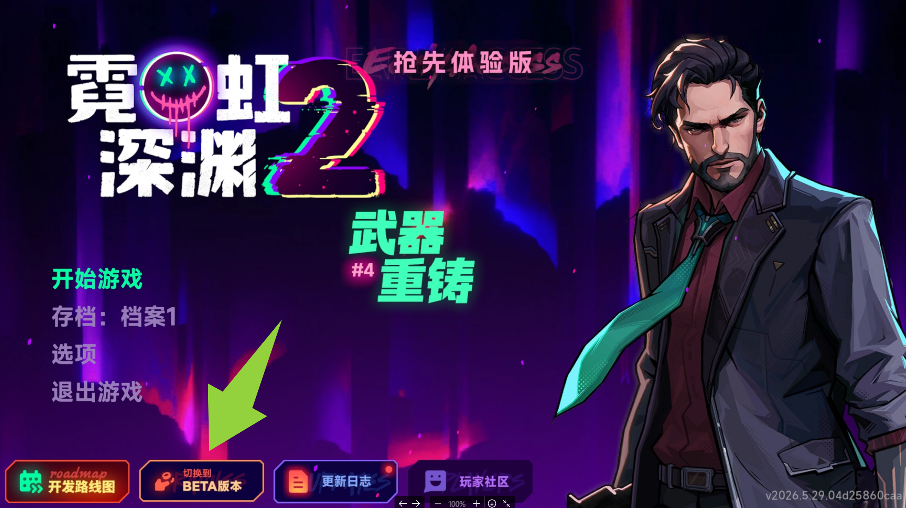

# Beta 分支组队测试活动开启！
各位特工，我们在 Beta 分支上线了一个全新的组队测试活动，正式向所有玩家开放，欢迎大家都来一起玩！
# 活动时间
- **开启**：6 月 05 日 上午 10:30（北京时间）
- **结束**：6 月 14 日 23:59（北京时间）
# 参与奖励
活动期间，玩家以组队模式分别胜利三场游戏，即可获得三件限定装扮奖励，感谢你和我们一起并肩作战！
# 关于这次活动
这次组队测试，其实也是在为六月中旬的新版本更新做稳定性方面的准备。
我们最近一直在重构和优化游戏的底层代码，这也是导致本次更新延迟的原因，真的很抱歉让大家久等了。我们希望通过这次测试，能让六月中旬上线的新版本获得更稳定、更好的体验。
对于每一位愿意参加测试活动、陪我们一起打磨游戏的玩家，我们都由衷地感谢。你们的每一次游玩与反馈，都会让《霓虹深渊2》变得更好。
# Beta 分支切换方法

在游戏主菜单点击“切换到BETA版本”按钮即可切换
或者
Steam 库 \>\>\> 霓虹深渊2 \>\>\> 右键 \>\>\> 属性 \>\>\> 测试版 \>\>\> Beta（无需输入密码）
另外请注意，不同的分支之间因为版本不同是无法进行联机的。
---
Veewo Games