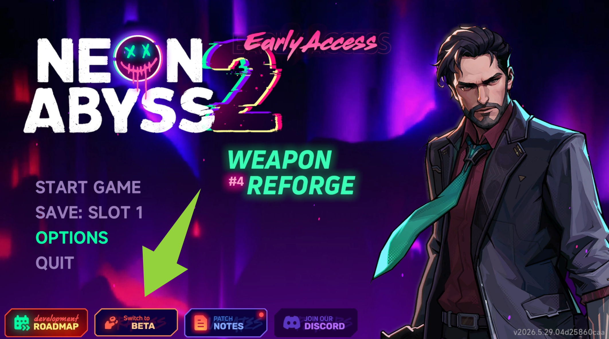

# Beta Branch Online Co-op Test Event Is Live!
Agents, we've just launched a brand-new online co-op test event on the Beta branch, now open to all players. Come and join the fun!
# Event Time
- **Start**: June 4, 7:30 PM (Pacific Time, PDT/GMT-7)
- **End**: June 14, 8:59 AM (Pacific Time, PDT/GMT-7)
# Rewards
During the event, win 3 games in co-op mode to receive three **limited-edition cosmetics** as rewards. Thanks for fighting alongside us!
# About This Event
This co-op test is also part of our preparation for the stability of the new version coming in mid-June.
We've been rebuilding and optimizing the game's underlying code lately, which is also the reason for the delay of this update. We're truly sorry for the wait. We hope this test will help the new version launching in mid-June deliver a more stable and enjoyable experience.
To every player who's willing to join the test and help us polish the game, we are sincerely grateful. Every session you play and every piece of feedback you share makes Neon Abyss 2 better.
# How to Switch to the Beta Branch

Click the “Switch to BETA” button on the game's main menu to switch over.
Or:
Steam Library \>\>\> Neon Abyss 2 \>\>\> Right-click \>\>\> Properties \>\>\> Betas \>\>\> Beta (no password required)
Please also note that different branches cannot play online together due to version differences.
---
Veewo Games