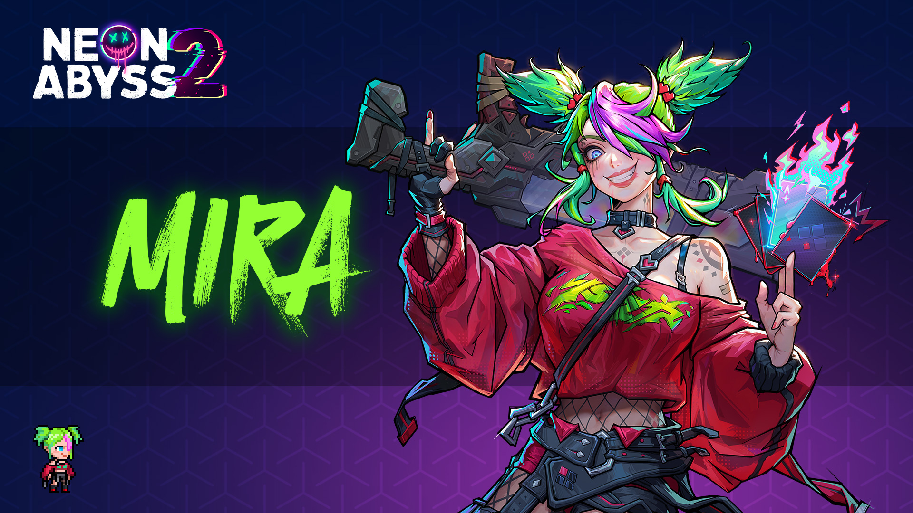
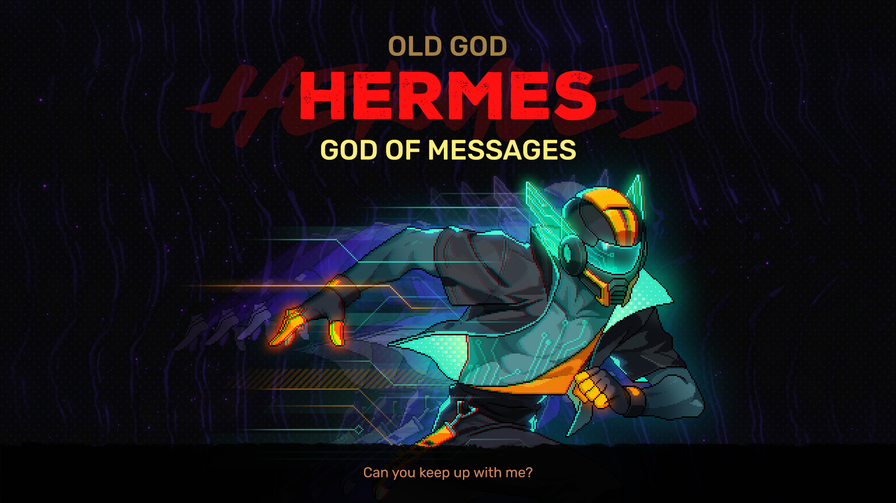
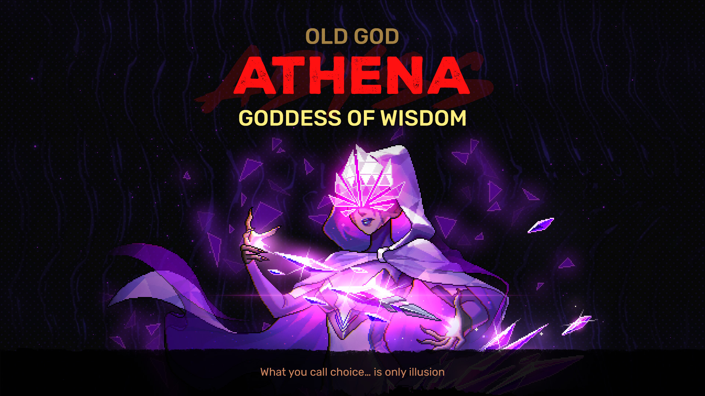
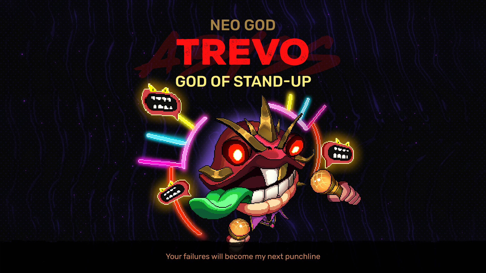
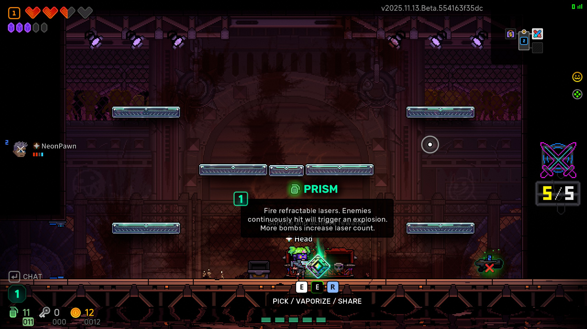
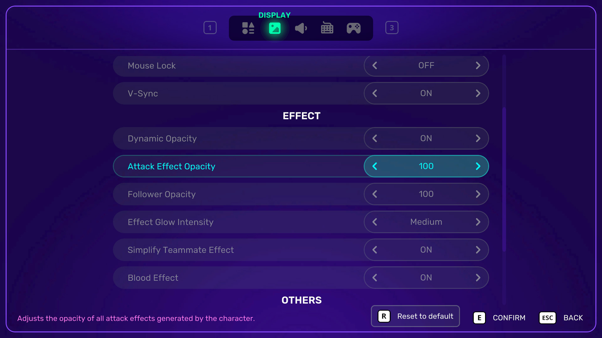
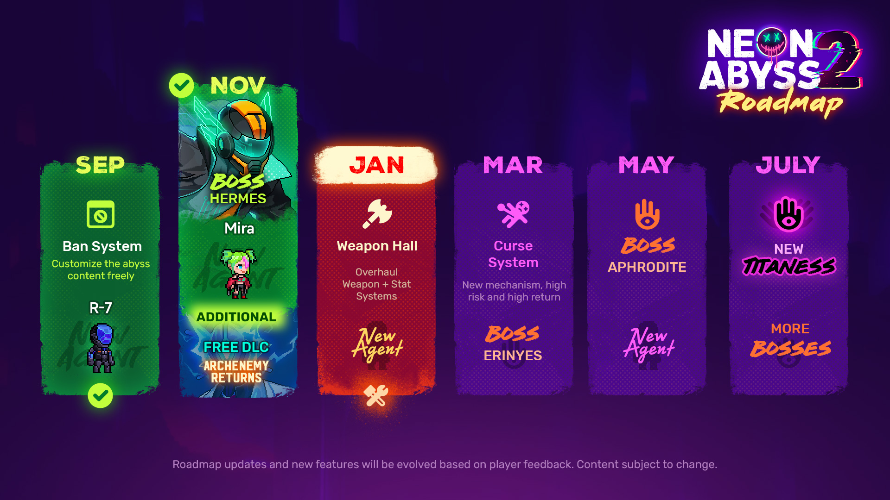

# Update Highlights
- New Agent: Mira, a reckless little maniac who thrives on danger
- New Manager BOSS: Hermes - God of Messages
- New Manager BOSS: Athena - Goddess of Wisdom
- New Regular BOSS: God of Stand-Up
- Co-op Optimization: Added item sharing mechanics, improved loot distribution
- Visual Effects Adjustment: Added transparency controls to reduce combat clutter
# New Agent
### Mira
A reckless little maniac obsessed with chaos and thrills, dancing with fate in fits of laughter. Pain is her sweetest reward.
\*Requires completing a specific task to unlock

# New Manager BOSS
### Hermes - God of Messages
In a world crisscrossed by countless fibers and signals, Hermes makes information travel at light speed. The pulse of global communication throbs at his fingertips, never ceasing.
**Unlock Condition**: Defeat Hyperion
**Trigger Condition:** Enter its corresponding green portal in the Safehouse

### Athena - Goddess of Wisdom
Included in the DLC "Archenemy Returns"
Where reality and illusion intertwine, Athena perceives every choice the world makes. Ancient strategy and modern order converge under her will—silent yet omnipresent.
**Unlock Condition**: Defeat Zeus
**Trigger Condition**: Encountered on the floor after defeating Zeus

# New Regular BOSS
### God of Stand-Up

# New Mechanics
## Co-op Item Sharing
**To enhance the multiplayer experience, we've optimized loot and item distribution mechanics.**
All drops are automatically assigned to players to prevent malicious sniping. Meanwhile, players can voluntarily share their loot with teammates, achieving a balance between fair distribution and free exchange.
**Specific rules:**
- Upon generation, drops can only be collected by their original owner
- Common drops (Coins, Bombs, Keys, etc.) become collectable after a set duration
- Special drops like Artifacts remain exclusive until manually shared

## Visual Clutter Optimization
To address potential visual chaos during combat, we've overhauled all attack effects and follower visuals. Players can now freely adjust their transparency in settings, toggling between "spectacular effects" and "clean visuals" as preferred. Find these options under **Settings \> Graphics**.

# New Content
## Weapons
**BLOODBOND**: The first Death's Door genre weapon! Charging at the right moment consumes all Hearts and Shields to summon a reusable Blood Servant. The weapon gains enhanced effects when at Death's Door.
**\*Requires completing a specific task to unlock**
## Misfortune
**Shadow Veil**: Obscured by darkness, your vision becomes limited.
# Roadmap Update

<empty-block/>
**Veewo Games**
<empty-block/>