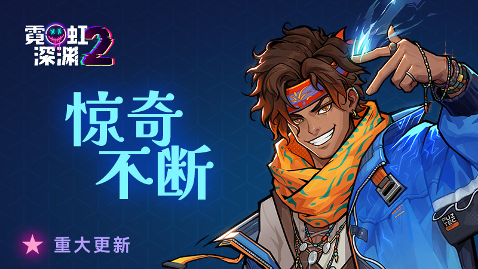
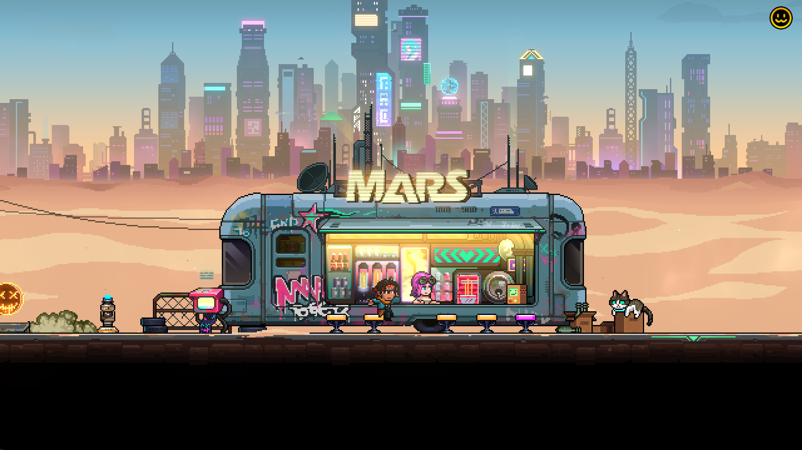
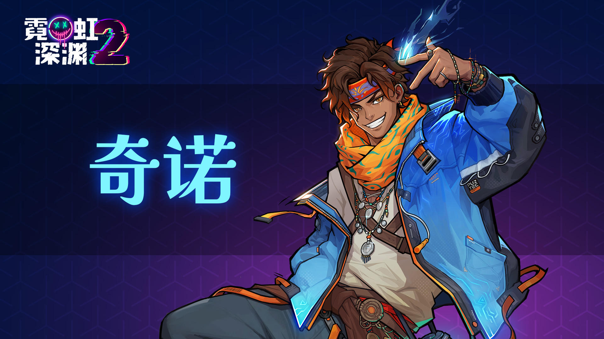
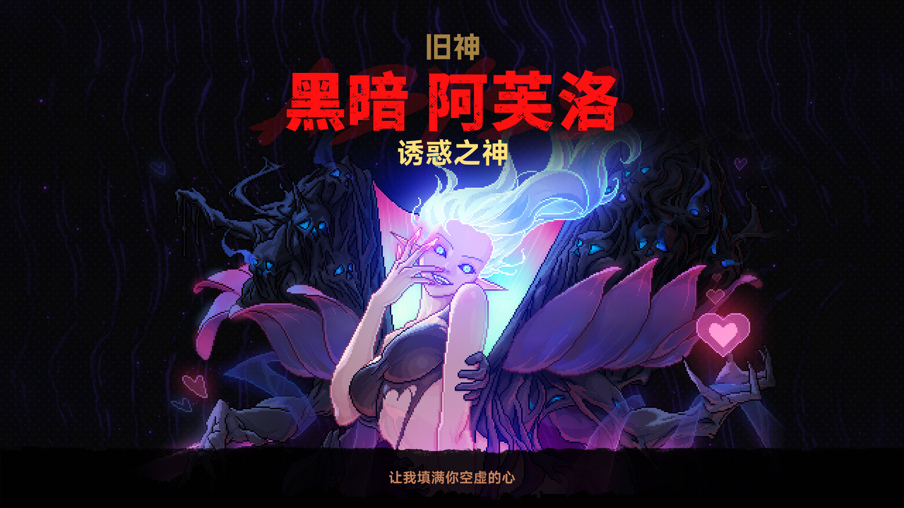
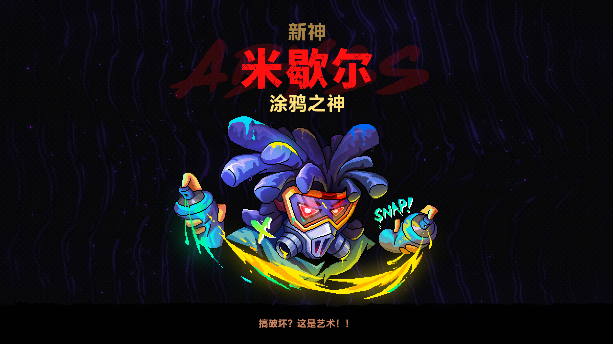
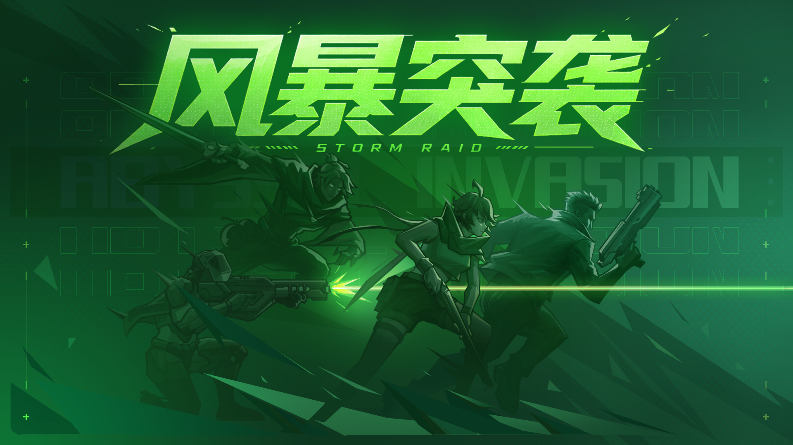
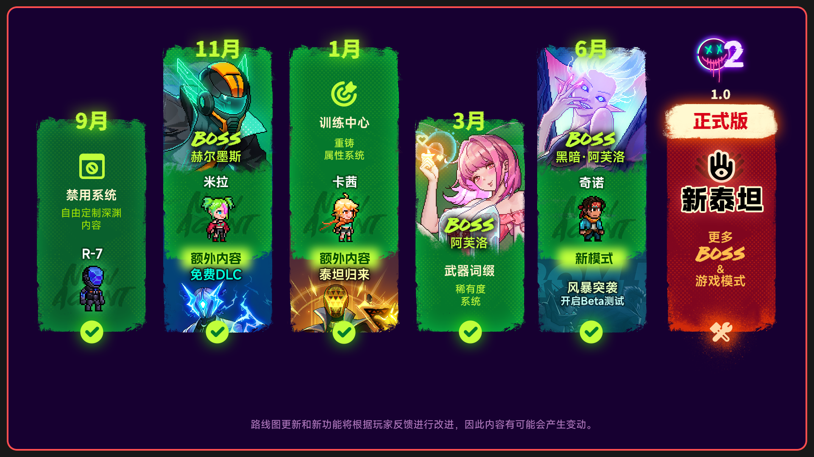

# 更新内容摘要
- 全新酒吧
- 新特工：奇诺
- 新高层BOSS：黑暗 阿芙洛
- 新普通BOSS：涂鸦之神
# 全新黑犬酒吧
为了躲避泰坦集团的调查，黑犬酒吧现在转移到了偏僻的郊区，而真正的酒吧藏在了沙漠之下！

# 新特工
## 奇诺
流浪街头的说唱歌手，口袋里永远装满惊奇。用节奏和歌声在城市的混乱中闯出自己的路。“押上心跳的Beats，惊奇绝不会Miss！”

# 新高层BOSS
## 黑暗 阿芙洛 - 诱惑之神
阿芙洛将情爱幻想编织成永不褪色的渴望。屏幕光芒映照着她曼妙的身姿，而每一次心动，皆成她的贡品。
解锁条件：击败普通版阿芙洛。
挑战条件：击败赫尔墨斯进入下一层时，拥有不少于10个哈基宝。

# 新普通BOSS
## 米歇尔 - 涂鸦之神
规矩？那是我最先涂掉的东西

# 新模式
## 风暴突袭模式 Beta 测试
我们会在 Beta 分支开启全新游戏模式「风暴突袭」的测试。

这是一个节奏更快、更精简的挑战模式。玩家不再需要探索地牢，而是围绕「选择路线、进入战斗、获取强化、突破关卡」展开，一层层推进，面对越来越强的敌人与更高强度的挑战。
欢迎大家体验并反馈问题与建议，帮助我们继续打磨这个模式。
---
# 路线图
我们已经开始制作最终的正式版本啦！因为涉及到的内容比较多，涉及到的多个平台的开发和优化，因此这段时间无法保证固定的更新时间\~我们会根据实际情况来不定期的更新的，直到最终1.0版本的上线。

