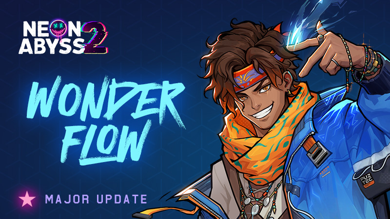
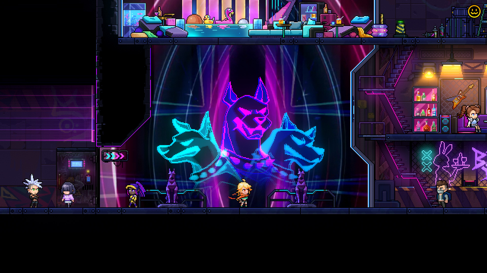
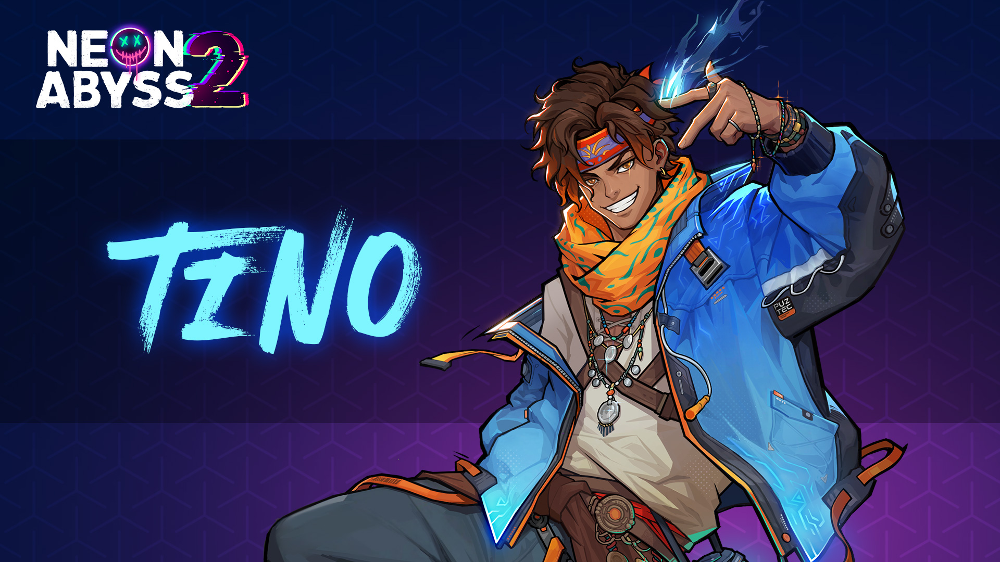
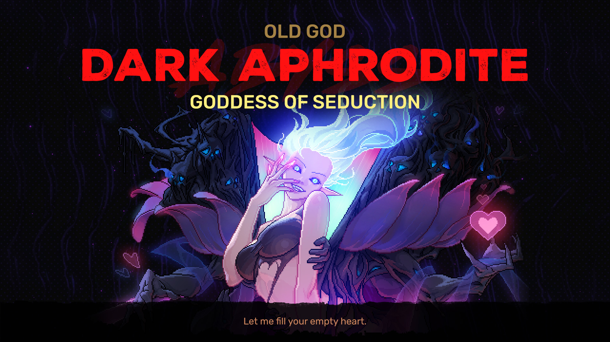
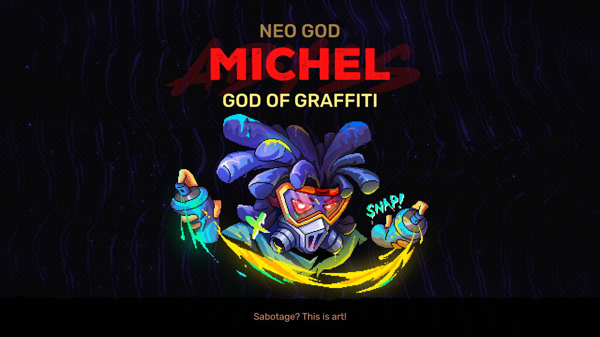
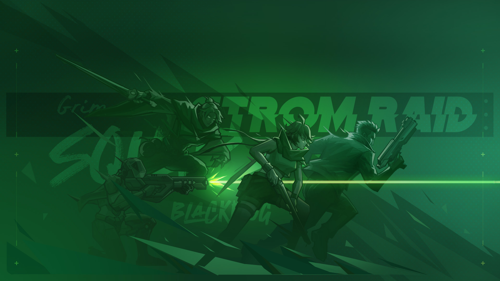
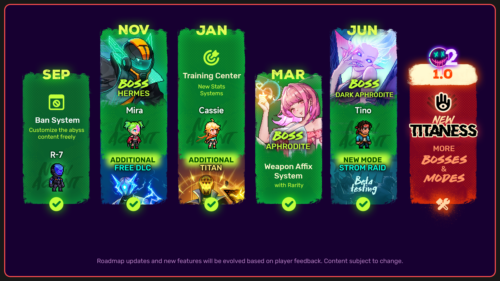

# Update Highlights
- New Blackdog Bar
- New Agent: Tino
- New Manager Boss: Dark Aphrodite
- New Regular Boss: God of Graffiti
# New Blackdog Bar
To evade Titan Group's investigation, the Blackdog Bar has relocated to a remote desert suburb, with the real bar hidden beneath the sands!

# New Agent
## Tino
A street-dwelling rapper whose pockets are always brimming with wonder. Using melody and flow, he blasts a trail through the neon-drenched chaos.

# New Manager Boss
## DARK APHRODITE - GODDESS OF SEDUCTION
Aphrodite weaves fantasies of love into desires that never fade. The screen's light caresses her alluring silhouette, and each heartbeat is an offering at her altar.
Unlock: Defeat regular Aphrodite.
Challenge: Defeat Hermes to enter next floor while having at least 10 Hatchmons.

# New Regular Boss
## MICHEL - GOD OF GRAFFITI
Rules? I spray over them first.

# New Assault Mode in Beta
We’ve opened testing for the new **Storm Raid** game mode on the Beta branch.

This is a faster, more streamlined mode with no dungeon exploration. Instead, you’ll focus on choosing your path, entering battles, gaining upgrades, and pushing through stage after stage as the challenge ramps up.
Try it out and let us know your feedback, issues, and suggestions so we can keep improving the mode.
---
# Roadmap
We have already started working on the ful version! Since it involves a lot of content, as well as development and optimization across multiple platforms, we cannot guarantee a fixed update schedule during this period. We will release updates irregularly based on the actual situation until the final version 1.0 is launched.

