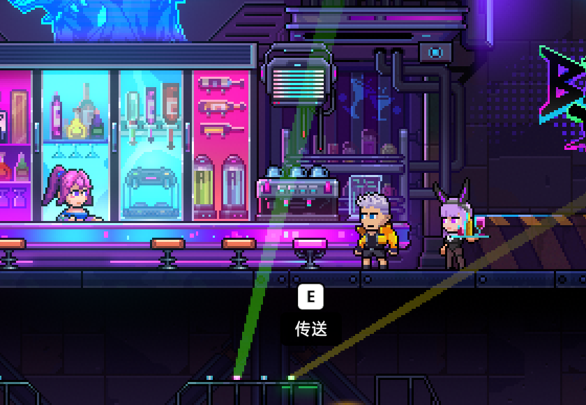

# 6月26日更新公告
注意：本次更新涉及继续游戏与模式存档逻辑，可能会影响正在进行中的继续游戏数据。请完成当前游戏内容后再进行更新。
---
### Bug 修复
- 修复了风暴突袭模式继续游戏时，可能错误进入深渊入侵模式的问题。
- 修复了多次进入武器升级房可能导致异常的问题。
- 修复了闯关模式第16关、部分房间传送门、信仰房/灵魂房返回等场景中可能卡住、无法离开或传送异常的问题。
- 修复了挑战房中动态怪可能阻塞清房的问题。
- 修复了篮球房联机交互可能卡死，以及单人情况下篮球不生成的问题。
- 修复了联机模式切回单人时，可能未断开中继服导致黑屏的问题。
- 修复了联机结算中玩家退出后可能导致平台消失、结算异常或断线的问题。
- 修复了联机信仰机错误改写主机信仰，以及离开信仰房后信仰未正确清除的问题。
- 修复了海咒不吐泡泡的问题。
- 修复了如意宝贝、神灯、奇异斗篷等部分道具效果异常的问题。
- 修复了工匠信仰神殿降级时，金色词条属性可能归零的问题。
- 修复了金箍棒蓄力后切换武器，旋转残影与循环音效残留的问题。
- 修复了命运界面 hover 卡片效果、结算界面苦难度命运值显示、倒计时 UI 初始显示等界面问题。
- 修复了删除存档提示不清晰、恢复默认按钮无法点击、对话框文本溢出、表情位置偏移等 UI 问题。
- 修复了公告中同段多图片可能导致 UI 报错的问题。
### 体验优化
酒吧下层增加了一个传送点

- 优化了继续游戏在不同游戏模式下的存档记录与恢复逻辑。
- 优化了蛋孵化的触发机制。
- 优化了部分怪物锚点与追踪配置。
- 修改语言时新增二次确认提示。
- 优化了多语言字体、按钮标题字体、剧情气泡高度与模式选择界面适配。
- 调整了酒吧地下吧台第五把椅子的传送位置。
- 更新了部分多语言文本与信仰房返回石提示。
---
**Veewo Games**