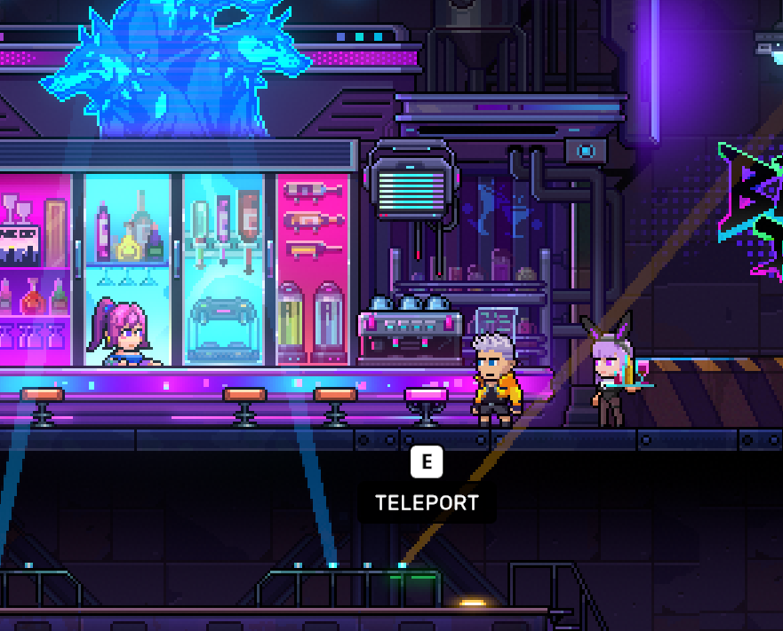

# June 26 Update Notice
Note: This update involves Continue Game and mode save logic, which may affect ongoing Continue Game data. Please finish your current game content before updating.
---
### Bug Fixes
- Fixed an issue where continuing a game in Storm Raid mode could incorrectly enter Abyss Invasion mode.
- Fixed an issue where entering the Weapon Upgrade Room multiple times could cause anomalies.
- Fixed an issue where players could get stuck, unable to leave, or experience abnormal teleports in scenarios such as Level 16 of Stage Mode, certain room teleports, and returning from Faith Room/Soul Room.
- Fixed an issue where dynamic monsters in Challenge Rooms could block room clearing.
- Fixed an issue where Basketball Room multiplayer interaction could freeze, and basketballs not spawning in single-player.
- Fixed an issue where switching from multiplayer to single-player might not disconnect from the relay server, causing a black screen.
- Fixed an issue where after a player leaves during multiplayer settlement, the platform may disappear, settlement may be abnormal, or disconnection may occur.
- Fixed an issue where multiplayer Faith machine incorrectly overwrote the host's Faith, and Faith not being properly cleared after leaving the Faith Room.
- Fixed an issue where SEASPELL does not produce bubbles.
- Fixed an issue with abnormal effects of some items such as Ruyi Baby, Djin Lamp, and Strange Cloak.
- Fixed an issue where gold affix attributes could reset to zero when the Artisan Faith Temple is downgraded.
- Fixed an issue where after charging JINGU BANG and switching weapons, spinning afterimages and looping sound effects remain.
- Fixed interface issues such as hover card effects on the Fate screen, ABYSSAL Fate value display on the settlement screen, and initial display of the countdown UI.
- Fixed UI issues such as unclear delete save prompt, unclickable reset default button, dialog text overflow, and Emote position offset.
- Fixed an issue where multiple images in the same section of an announcement could cause a UI error.
### Experience Improvements
Added a teleport point in the lower level of the bar

- Optimized the save record and restore logic for Continue Game across different game modes.
- Optimized the trigger mechanism for Egg hatching.
- Optimized anchor points and tracking configurations for some Monsters.
- Added a secondary confirmation prompt when changing language.
- Optimized multilingual fonts, button title fonts, story bubble height, and mode selection interface adaptation.
- Adjusted the teleport position of the fifth chair at the underground bar counter.
- Updated some multilingual texts and Faith Room Return Stone prompts.
---
**Veewo Games**